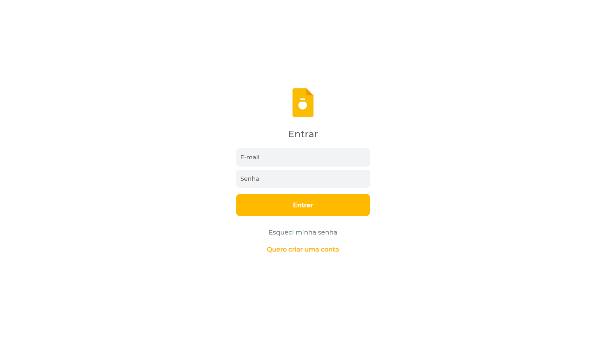
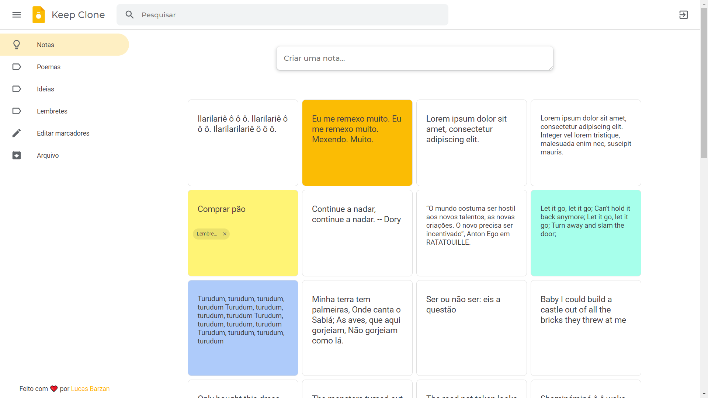
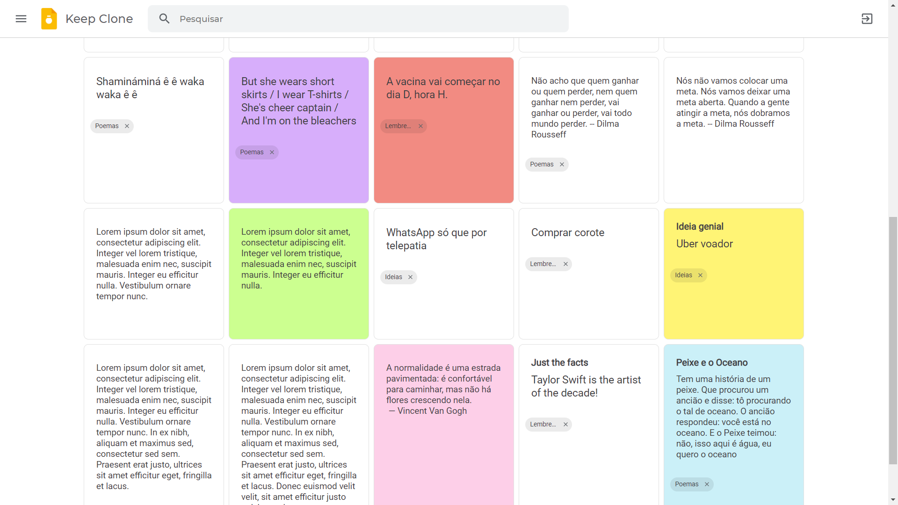
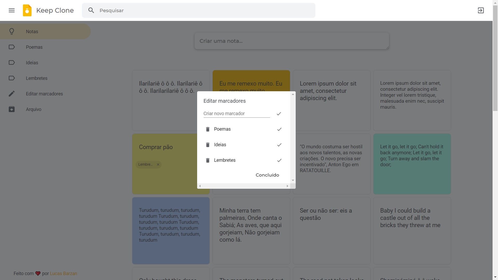
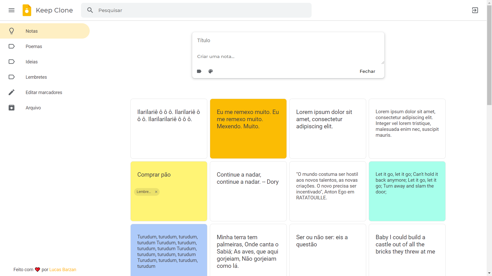

<h4 align="center">
     🇺🇸 <a href="https://github.com/lucasbarzan/google-keep-clone/blob/main/README.md" alt="Read in English"> Read in English (en-US) </a>
</h4>

<h1 align="center">
     💡 <a href="#" alt="Google Keep Clone"> Google Keep Clone </a>
</h1>

<h3 align="center">
    💡 App web de notas inspirado no Google Keep 📝
</h3>

<p align="center">
  

  
  
  <a href="https://github.com/lucasbarzan/google-keep-clone/commits/master">
    
  </a>
    
   
   <a href="https://github.com/lucasbarzan/google-keep-clone/stargazers">
    
  </a>
</p>

<h4 align="center">
	🚀 Finalizado! 🚀
</h4>

Tabela de conteúdos
=================

   * [Autor](#autor)
   * [Sobre o projeto](#sobre-o-projeto)
   * [Funcionalidades](#funcionalidades)
   * [Layout](#layout)
     * [Web](#layout-web)
   * [Como executar o projeto](#como-executar-o-projeto)
     * [Pré-requisitos](#pre-requisitos)
     * [Rodando o Backend (servidor)](#rodando-o-backend-servidor)
     * [Rodando a aplicação web (Frontend)](#rodando-a-aplicacao-web-frontend)
   * [Tecnologias](#tecnologias)
     * [Website](#tecnologias-website)
     * [Server](#tecnologias-server)
     * [Utilitários](#utilitarios)
   * [Como contribuir no projeto](#como-contribuir)
   * [Licença](#licenca)


## 🦸 Autor <a name="autor"></a>

<a href="https://github.com/lucasbarzan/">
 
 <br />
 <sub><b>Lucas Barzan</b></sub></a>
 <br />

[](https://www.linkedin.com/in/lucasbarzan/) 
[](mailto:lucasbarzand@gmail.com)

---

## 💻 Sobre o projeto <a name="sobre-o-projeto"></a>

💡 O Google Keep Clone é um app web de notas inspirado no Google Keep, que visa reproduzir os principais aspectos e funcionalidades da famosa aplicação utilizando ReactJS e Node.js.

---

## ⚙️ Funcionalidades <a name="funcionalidades"></a>

- [x] Interface responsiva
- [x] Cadastro e login com e-mail e senha do usuário
- [x] Busca, criação, atualização e exclusão de notas
- [x] Infinite scrolling na listagem de notas no frontend
- [x] Possibilidade de criar tags (categorias) e associá-las a notas
- [x] Possibilidade de listar notas por tag
- [x] Personalização da cor das notas
- [x] Recuperação de senha em caso de esquecimento

---

## 🎨 Layout <a name="layout"></a>

O layout do Google Keep Clone traz vários elementos da aplicação original, como é possível visualizar nas capturas de tela abaixo:

### Web <a name="layout-web"></a>

<p align="center" style="display: flex; align-items: flex-start; justify-content: center;">
  

  
</p>

<p align="center" style="display: flex; align-items: flex-start; justify-content: center;">
  

  
</p>

<p align="center" style="display: flex; align-items: flex-start; justify-content: center;">
  

  
</p>

---

## 🚀 Como executar o projeto <a name="como-executar-o-projeto"></a>

Este projeto é dividido em duas partes:
1. Backend (pasta server) 
2. Frontend (pasta web)

💡 O Frontend precisa que o Backend esteja sendo executado para funcionar.

### Pré-requisitos <a name="pre-requisitos"></a>

Antes de começar, você vai precisar ter instalado em sua máquina as seguintes ferramentas:
[Git](https://git-scm.com), [Node.js](https://nodejs.org/en/).

Além disso, é bom ter um editor para trabalhar com o código como [VSCode](https://code.visualstudio.com/).

#### 🎲 Rodando o Backend (servidor) <a name="rodando-o-backend-servidor"></a>

```bash

# Clone este repositório
$ git clone git@github.com:lucasbarzan/google-keep-clone.git

# Acesse a pasta do projeto no terminal/cmd
$ cd google-keep-clone

# Vá para a pasta server
$ cd server

# Instale as dependências
$ npm install OU yarn

# Crie um arquivo com as configurações do banco de dados a partir do arquivo de exemplo
# (você pode modificar os dados caso necessário)
$ cp ormconfig.example.json ormconfig.json

# Crie um arquivo com as variáveis de ambiente a partir do arquivo de exemplo
$ cp .env.example .env

# A aplicação utiliza banco de dados MySQL. Caso não tenha um ainda, recomendo criar um container mysql usando o Docker.
# Com o Docker instalado e rodando, execute o comando abaixo para criar o container "keep_clone"
$ docker run --name keep_clone -e MYSQL_ROOT_PASSWORD=docker -p 3306:3306 -d mysql:8.0.22

# Crie um banco de dados chamado "keep_clone" (ou o nome que você deu nas configurações).
# Você pode usar um software como o DBeaver para fazer isso, por exemplo.

# Rode as migrations do banco de dados
$ yarn typeorm migration:run

# A aplicação utiliza banco Redis. Caso não tenha um ainda, recomendo criar um container redis usando o Docker.
# Com o Docker instalado e rodando, execute o comando abaixo para criar o container "keep_clone_redis"
$ docker run --name keep_clone_redis -p 6379:6379 -d -t redis:alpine

# Execute a aplicação em modo de desenvolvimento
$ npm run dev:server OU yarn dev:server

# O servidor inciará na porta 3333 - acesse http://localhost:3333 

```
<p align="center">
  <a href="https://github.com/lucasbarzan/google-keep-clone/blob/master/Insomnia_API_Keep_Clone.json" target="_blank"></a>
</p>


#### 🧭 Rodando a aplicação web (Frontend) <a name="rodando-a-aplicacao-web-frontend"></a>

```bash

# Clone este repositório (caso ainda não o tenha feito!)
$ git clone git@github.com:lucasbarzan/google-keep-clone.git

# Acesse a pasta do projeto no seu terminal/cmd
$ cd google-keep-clone

# Vá para a pasta da aplicação Frontend
$ cd web

# Instale as dependências
$ npm install OU yarn

# Execute a aplicação em modo de desenvolvimento
$ npm run start OU yarn start

# A aplicação será aberta na porta 3000 - acesse http://localhost:3000

```

---

## 🛠 Tecnologias <a name="tecnologias"></a>

As seguintes ferramentas foram usadas na construção do projeto:

-   **[EditorConfig](https://editorconfig.org/)**
-   **[ESLint](https://eslint.org/)**
-   **[Prettier](https://prettier.io/)**

#### **Website**  ([React](https://reactjs.org/)  +  [TypeScript](https://www.typescriptlang.org/)) <a name="tecnologias-website"></a>

-   **[React Router Dom](https://github.com/ReactTraining/react-router/tree/master/packages/react-router-dom)**
-   **[Styled Components](https://styled-components.com/)**
-   **[polished](https://polished.js.org/)**
-   **[react-spring](https://www.react-spring.io/)**
-   **[Axios](https://github.com/axios/axios)**
-   **[query-string](https://www.npmjs.com/package/query-string)**
-   **[Unform](https://github.com/Rocketseat/unform)**
-   **[create-react-app](https://github.com/facebook/create-react-app)**
-   **[react-icons](https://react-icons.github.io/react-icons/)**
-   **[react-infinite-scroll-component](https://www.npmjs.com/package/react-infinite-scroll-component)**
-   **[react-modal](https://www.npmjs.com/package/react-modal)**
-   **[yup](https://github.com/jquense/yup)**


> Veja o arquivo [package.json](https://github.com/lucasbarzan/google-keep-clone/blob/master/web/package.json)

#### **Server**  ([NodeJS](https://nodejs.org/en/)  +  [TypeScript](https://www.typescriptlang.org/)) <a name="tecnologias-server"></a>

-   **[Express](https://expressjs.com/)**
-   **[bcryptjs](https://www.npmjs.com/package/bcryptjs)**
-   **[uuid](https://www.npmjs.com/package/uuid)**
-   **[jsonwebtoken](https://www.npmjs.com/package/jsonwebtoken)**
-   **[celebrate](https://github.com/arb/celebrate)**
-   **[handlebars](https://www.npmjs.com/package/handlebars)**
-   **[class-transformer](https://github.com/typestack/class-transformer)**
-   **[date-fns](https://date-fns.org/)**
-   **[dotenv](https://www.npmjs.com/package/dotenv)**
-   **[CORS](https://expressjs.com/en/resources/middleware/cors.html)**
-   **[mysql2](https://www.npmjs.com/package/mysql2)**
-   **[TypeORM](https://typeorm.io/)**
-   **[redis](https://www.npmjs.com/package/redis)**
-   **[ioredis](https://www.npmjs.com/package/ioredis)**
-   **[nodemailer](https://www.npmjs.com/package/nodemailer)**
-   **[aws-sdk](https://www.npmjs.com/package/aws-sdk)**
-   **[helmet](https://helmetjs.github.io/)**
-   **[tsyringe](https://github.com/microsoft/tsyringe)**
-   **[Jest](https://jestjs.io/)**
-   **[Sentry](https://sentry.io/)**

> Veja o arquivo [package.json](https://github.com/lucasbarzan/google-keep-clone/blob/master/server/package.json)

#### **Utilitários** <a name="utilitarios"></a>

-   Editor:  **[Visual Studio Code](https://code.visualstudio.com/)**
-   Teste de API:  **[Insomnia](https://insomnia.rest/)**
-   Fontes:  **[Montserrat](https://fonts.google.com/specimen/Montserrat)** e **[Roboto](https://fonts.google.com/specimen/Roboto)**

---

## 💪 Como contribuir no projeto <a name="como-contribuir"></a>

1. Faça um **fork** do projeto.
2. Crie uma nova branch com as suas alterações: `git checkout -b my-feature`
3. Salve as alterações e crie uma mensagem de commit contando o que você fez: `git commit -m "feature: My new feature"`
4. Envie as suas alterações: `git push origin my-feature`

---

## 📝 Licença <a name="licenca"></a>

Este projeto esta sob a licença [MIT](./LICENSE).

Feito com ❤️ por Lucas Barzan 👋🏽
