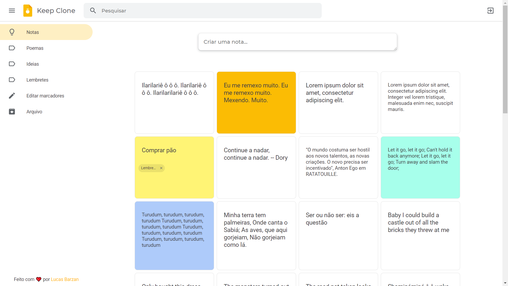
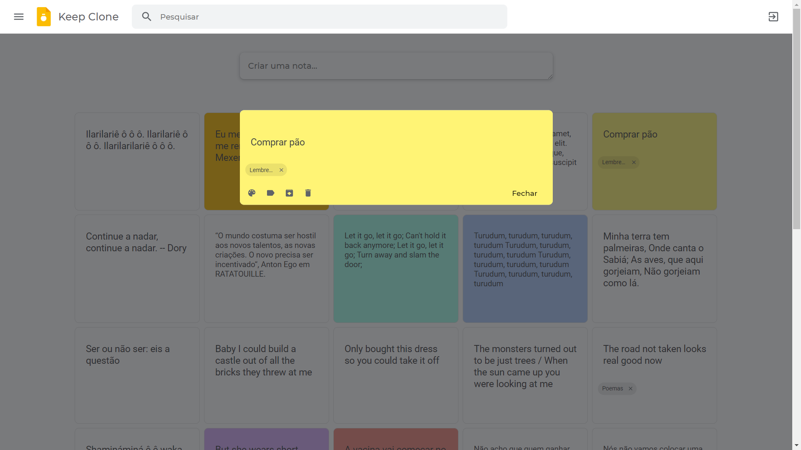

<h4 align="center">
     🇧🇷 <a href="https://github.com/lucasbarzan/google-keep-clone/blob/main/README-pt-BR.md" alt="Ler em Português"> Ler em Português (pt-BR) </a>
</h4>

<h1 align="center">
     💡 <a href="#" alt="Google Keep Clone"> Google Keep Clone </a>
</h1>

<h3 align="center">
    💡 Web notes app inspired by Google Keep 📝
</h3>

<p align="center">
  

  
  
  <a href="https://github.com/lucasbarzan/google-keep-clone/commits/master">
    
  </a>
    
   
   <a href="https://github.com/lucasbarzan/google-keep-clone/stargazers">
    
  </a>
</p>

<h4 align="center">
	🚀 Finished! 🚀
</h4>

Table of Contents
=================

   * [Author](#autor)
   * [About the project](#sobre-o-projeto)
   * [Features](#funcionalidades)
   * [Layout](#layout)
     * [Web](#layout-web)
   * [How to run it](#como-executar-o-projeto)
     * [Prerequisites](#pre-requisitos)
     * [Running the Backend (server)](#rodando-o-backend-servidor)
     * [Running the web app (Frontend)](#rodando-a-aplicacao-web-frontend)
   * [Technologies](#tecnologias)
     * [Website](#tecnologias-website)
     * [Server](#tecnologias-server)
     * [Utilities](#utilitarios)
   * [How to contribute](#como-contribuir)
   * [License](#licenca)


## 🦸 Author <a name="autor"></a>

<a href="https://github.com/lucasbarzan/">
 
 <br />
 <sub><b>Lucas Barzan</b></sub></a>
 <br />

[](https://www.linkedin.com/in/lucasbarzan/) 
[](mailto:lucasbarzand@gmail.com)

---

## 💻 About the project <a name="sobre-o-projeto"></a>

💡 Google Keep Clone is a web notes app inspired by Google Keep, which aims to reproduce the main aspects and features of the famous application using ReactJS and Node.js.

---

## ⚙️ Features <a name="funcionalidades"></a>

- [x] Responsive UI
- [x] Signup and Login with user's e-mail and password
- [x] User is able to search, create, update and delete notes
- [x] Infinite scrolling (in the list of notes on the frontend)
- [x] User is able to create tags (categories/labels) and associate them with notes
- [x] User is able to list notes by tag
- [x] User is able to customize the color of notes
- [x] User is able to reset their password once they forget it

---

## 🎨 Layout <a name="layout"></a>

The Google Keep Clone layout brings several elements of the original application, as you can see in the screenshots below:

### Web <a name="layout-web"></a>

<p align="center" style="display: flex; align-items: flex-start; justify-content: center;">
  

  
</p>

<p align="center" style="display: flex; align-items: flex-start; justify-content: center;">
  

  
</p>

<p align="center" style="display: flex; align-items: flex-start; justify-content: center;">
  

  
</p>

---

## 🚀 How to run it <a name="como-executar-o-projeto"></a>

This project is divided into two parts:
1. Backend ("server" folder)
2. Frontend ("web" folder)

💡 The Frontend needs the Backend to be running in order to work properly.

### Prerequisites <a name="pre-requisitos"></a>

Before you begin, you will need to have the following tools installed on your machine:
[Git](https://git-scm.com), [Node.js](https://nodejs.org/en/).

Also, it’s good to have an editor to work with the code like [VSCode](https://code.visualstudio.com/).

#### 🎲 Running the Backend (server) <a name="rodando-o-backend-servidor"></a>

```bash

# Clone this repository
$ git clone git@github.com:lucasbarzan/google-keep-clone.git

# Access the project folder on your terminal/cmd
$ cd google-keep-clone

# Go to server folder
$ cd server

# Install the dependencies
$ npm install OR yarn

# Create a file with the database configs following the example file
# (you can change the values if needed)
$ cp ormconfig.example.json ormconfig.json

# Create a file with the environment variables following the example file
$ cp .env.example .env

# The app uses a MySQL database. If you don't have one yet, I recommend creating a mysql container using Docker. 
# With Docker installed and running, execute the command below to create the "keep_clone" container
$ docker run --name keep_clone -e MYSQL_ROOT_PASSWORD=docker -p 3306:3306 -d mysql:8.0.22

# Create a database called "keep_clone" (or the name you gave in the settings).
# You can use a software like DBeaver to do this, for example.

# Run the database migrations
$ yarn typeorm migration:run

# The application uses a Redis database. If you don't have one yet, I recommend creating a redis container using Docker.
# With Docker installed and running, execute the command below to create the container "keep_clone_redis"
$ docker run --name keep_clone_redis -p 6379:6379 -d -t redis:alpine

# Run the application in development mode
$ npm run dev:server OR yarn dev:server

# The server will start on port 3333 - access http://localhost:3333 

```
<p align="center">
  <a href="https://github.com/lucasbarzan/google-keep-clone/blob/master/Insomnia_API_Keep_Clone.json" target="_blank"></a>
</p>


#### 🧭 Running the web app (Frontend) <a name="rodando-a-aplicacao-web-frontend"></a>

```bash

# Clone this repository (if you haven't already!)
$ git clone git@github.com:lucasbarzan/google-keep-clone.git

# Access the project folder in your terminal/cmd
$ cd google-keep-clone

# Go to the Frontend application folder
$ cd web

# Install the dependencies
$ npm install OU yarn

# Run the application in development mode
$ npm run start OU yarn start

# The application will start on port 3000 - access http://localhost:3000

```

---

## 🛠 Technologies <a name="tecnologias"></a>

The following tools were used in the construction of the project:

-   **[EditorConfig](https://editorconfig.org/)**
-   **[ESLint](https://eslint.org/)**
-   **[Prettier](https://prettier.io/)**

#### **Website**  ([React](https://reactjs.org/)  +  [TypeScript](https://www.typescriptlang.org/)) <a name="tecnologias-website"></a>

-   **[React Router Dom](https://github.com/ReactTraining/react-router/tree/master/packages/react-router-dom)**
-   **[Styled Components](https://styled-components.com/)**
-   **[polished](https://polished.js.org/)**
-   **[react-spring](https://www.react-spring.io/)**
-   **[Axios](https://github.com/axios/axios)**
-   **[query-string](https://www.npmjs.com/package/query-string)**
-   **[Unform](https://github.com/Rocketseat/unform)**
-   **[create-react-app](https://github.com/facebook/create-react-app)**
-   **[react-icons](https://react-icons.github.io/react-icons/)**
-   **[react-infinite-scroll-component](https://www.npmjs.com/package/react-infinite-scroll-component)**
-   **[react-modal](https://www.npmjs.com/package/react-modal)**
-   **[yup](https://github.com/jquense/yup)**


> See [package.json](https://github.com/lucasbarzan/google-keep-clone/blob/master/web/package.json)

#### **Server**  ([NodeJS](https://nodejs.org/en/)  +  [TypeScript](https://www.typescriptlang.org/)) <a name="tecnologias-server"></a>

-   **[Express](https://expressjs.com/)**
-   **[bcryptjs](https://www.npmjs.com/package/bcryptjs)**
-   **[uuid](https://www.npmjs.com/package/uuid)**
-   **[jsonwebtoken](https://www.npmjs.com/package/jsonwebtoken)**
-   **[celebrate](https://github.com/arb/celebrate)**
-   **[handlebars](https://www.npmjs.com/package/handlebars)**
-   **[class-transformer](https://github.com/typestack/class-transformer)**
-   **[date-fns](https://date-fns.org/)**
-   **[dotenv](https://www.npmjs.com/package/dotenv)**
-   **[CORS](https://expressjs.com/en/resources/middleware/cors.html)**
-   **[mysql2](https://www.npmjs.com/package/mysql2)**
-   **[TypeORM](https://typeorm.io/)**
-   **[redis](https://www.npmjs.com/package/redis)**
-   **[ioredis](https://www.npmjs.com/package/ioredis)**
-   **[nodemailer](https://www.npmjs.com/package/nodemailer)**
-   **[aws-sdk](https://www.npmjs.com/package/aws-sdk)**
-   **[helmet](https://helmetjs.github.io/)**
-   **[tsyringe](https://github.com/microsoft/tsyringe)**
-   **[Jest](https://jestjs.io/)**
-   **[Sentry](https://sentry.io/)**

> See [package.json](https://github.com/lucasbarzan/google-keep-clone/blob/master/server/package.json)

#### **Utilities** <a name="utilitarios"></a>

-   Editor:  **[Visual Studio Code](https://code.visualstudio.com/)**
-   API tests:  **[Insomnia](https://insomnia.rest/)**
-   Fonts:  **[Montserrat](https://fonts.google.com/specimen/Montserrat)** and **[Roboto](https://fonts.google.com/specimen/Roboto)**

---

## 💪 How to contribute <a name="como-contribuir"></a>

1. **Fork** the project.
2. Create a new branch with your changes: `git checkout -b my-feature`
3. Save your changes and create a commit message describing what you did: `git commit -m" feature: My new feature "`
4. Submit your changes: `git push origin my-feature`

---

## 📝 License <a name="licenca"></a>

This project is under [MIT](./LICENSE) license.

Made with ❤️ by Lucas Barzan 👋🏽
